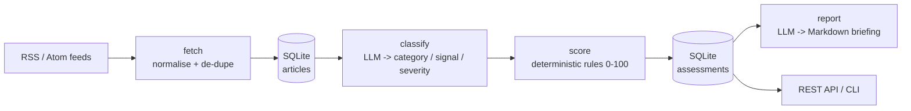

# ESG Risk Screener

Screens business news for ESG (Environmental, Social, Governance) risk signals and
turns them into an explainable reputational / credit-risk score, plus a short
briefing for a credit committee.

Built as an **AI-automation pipeline**: RSS ingestion → LLM classification →
deterministic scoring → LLM-written summary. The LLM layer is provider-agnostic
and ships with an offline stub so the whole thing runs (and is tested) without an
API key.

> Motivation: I do ESG news screening for corporate credit risk by hand at work.
> This automates the repetitive part.

## Pipeline



Only two steps call the LLM (`classify`, `report`). Scoring is pure Python so the
number is reproducible and auditable — see [`score.py`](src/esg_risk_screener/score.py).

## Quickstart

```bash
uv sync
uv run pytest                 # 28 tests, no API key needed (offline stub)
cp .env.example .env          # then paste a Gemini key (free: aistudio.google.com)
uv run esg-screener run       # fetch + classify + score
uv run esg-screener report    # print the briefing
```

Without a key the pipeline still runs end to end using the deterministic
`fake` provider; set `LLM_PROVIDER=gemini` + `GEMINI_API_KEY` for real classification.

### HTTP API

```bash
uv run uvicorn esg_risk_screener.api:app --reload
# http://127.0.0.1:8000/docs
```

| Method | Path            | Purpose                          |
|--------|-----------------|----------------------------------|
| GET    | `/health`       | liveness                         |
| POST   | `/run`          | run the pipeline                 |
| GET    | `/assessments`  | all scored articles, worst first |
| GET    | `/stats`        | aggregate counts                 |
| GET    | `/report`       | Markdown briefing                |

## Configuration

All settings come from environment / `.env` (see [`config.py`](src/esg_risk_screener/config.py)):

| Var            | Default              | Notes                                  |
|----------------|----------------------|----------------------------------------|
| `LLM_PROVIDER` | `gemini`             | `gemini` or `fake`                     |
| `LLM_MODEL`    | `gemini-2.0-flash`   | any Gemini model id                    |
| `GEMINI_API_KEY` | –                  | required only for `gemini`             |
| `DB_PATH`      | `data/articles.db`   | SQLite file                            |

## Prompt engineering

Prompts are versioned Markdown under [`prompts/`](prompts/). The classifier is
evaluated against a labelled set in [`evals/`](evals/):

```bash
uv run python evals/run_evals.py     # writes evals/RESULTS.md
```

## Tech

Python 3.14 · uv · Pydantic · FastAPI · SQLite · Google Gemini · pytest · ruff ·
GitHub Actions.

## Status / roadmap

- [x] Ingestion, classification, scoring, report, CLI, offline stub, tests, CI
- [ ] API auth + pagination + rate limiting
- [ ] Live deployment (Render)
- [ ] n8n workflow export
- [ ] Larger labelled eval set + published metrics

## License

MIT — see [LICENSE](LICENSE).
